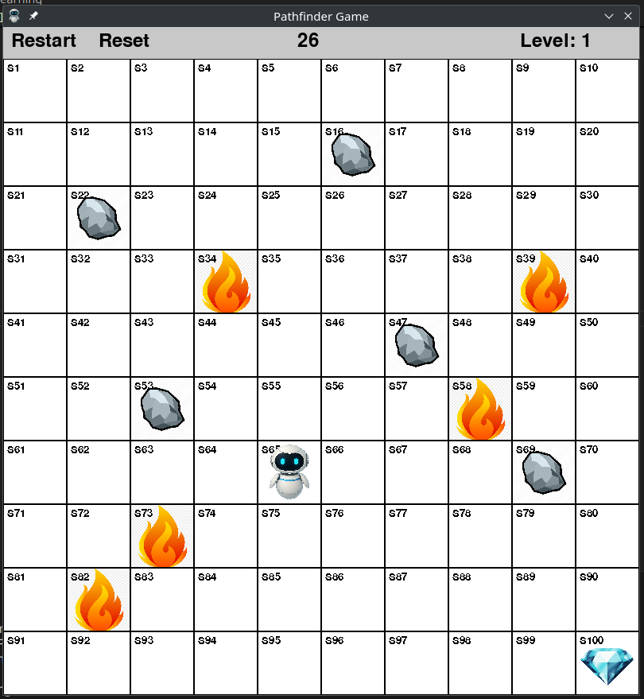
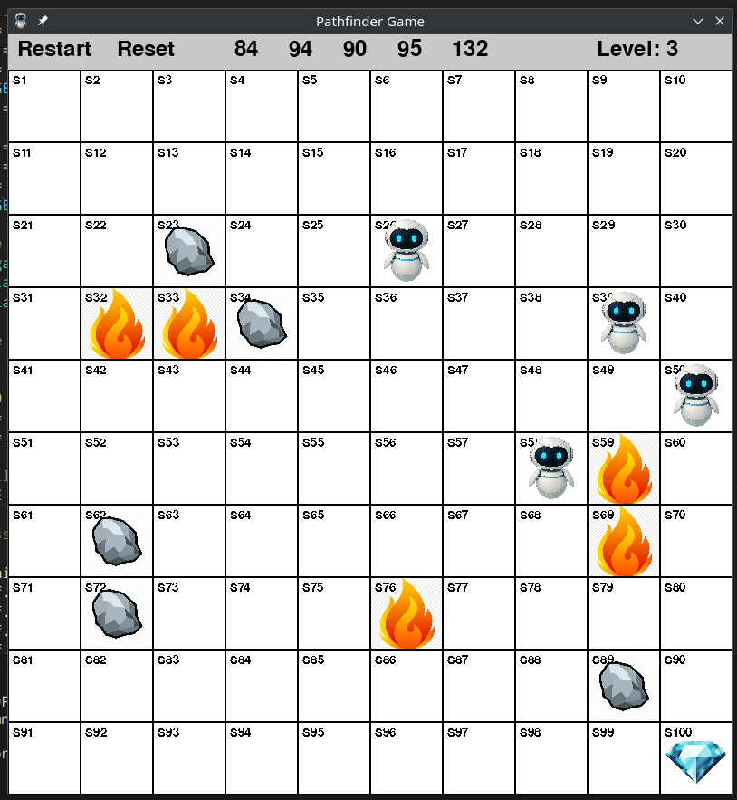

# Pathfinder Game with Q-Learning

This project implements a pathfinding game using the Q-learning algorithm. The goal is for agents to navigate a grid-based environment to reach a diamond, avoiding obstacles like stones and fire.

## Game Overview

The game features a grid where agents must find their way to a diamond. The environment includes:

*   **Grid:** A 10x10 grid where each cell can be empty, contain a stone, fire, or the diamond.
*   **Agents:** Multiple agents (default 5) that move simultaneously.
*   **Obstacles:** Stones and fire are randomly placed in the grid.
*   **Diamond:** Located in the bottom-right corner (9, 9).
*   **Starting Point:** Agents begin at the top-left corner (0, 0).

## Q-Learning Implementation

Q-learning is used to train the agents to find the optimal path to the diamond. Key aspects of the Q-learning implementation include:

*   **Q-Table:** A table that stores Q-values for each state-action pair.
*   **Actions:** Agents can move up, down, left, or right.
*   **Reward System:**
    *   Reaching the diamond: +10
    *   Moving to a valid cell: -0.1
    *   Moving into fire: -10
    *   Staying in place (invalid move): -0.2
    *   Increased reward for paths in the middle of the matrix.
    *   Increased reward for moves along the bottom row and rightmost column (except the diamond itself) if they bring the agent closer to the goal.
*   **Learning Rate:** 0.1
*   **Discount Factor:** 0.9
*   **Epsilon:** 0.1 (for exploration vs. exploitation)

## Features

*   **Multiple Agents:** Supports multiple agents moving simultaneously.
*   **Levels:** The game has multiple levels, with increasing difficulty. The number of stones and fire increases with each level.
*   **Menu Bar:**
    *   Restart button: Resets the level, score, and attempts.
    *   Reset button: Resets agents to the start of the current level and restores their scores.
    *   Score counter: Displays each agent's score.
    *   Level counter: Displays the current level.
*   **Pause Feature:** The game can be paused using the spacebar. A pixelated effect is applied to the game area when paused.
*   **Game Over:** The game ends when the level exceeds 100, and the final score and attempts are written to `winners.txt`.

## Working App Images

## Controls

*   Spacebar: Pause/Unpause
*   R: Restart the level
*   Q or ESC: Quit the game